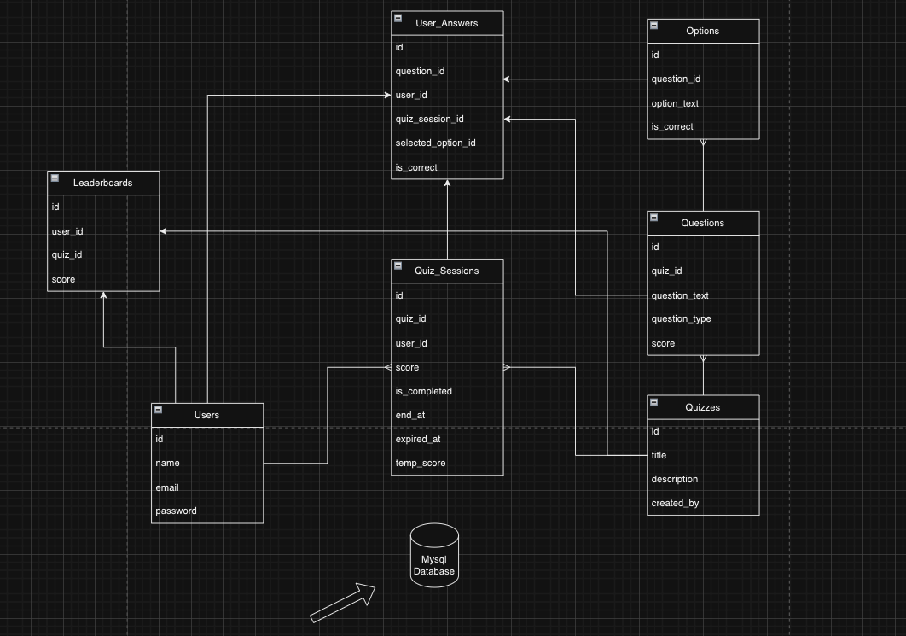
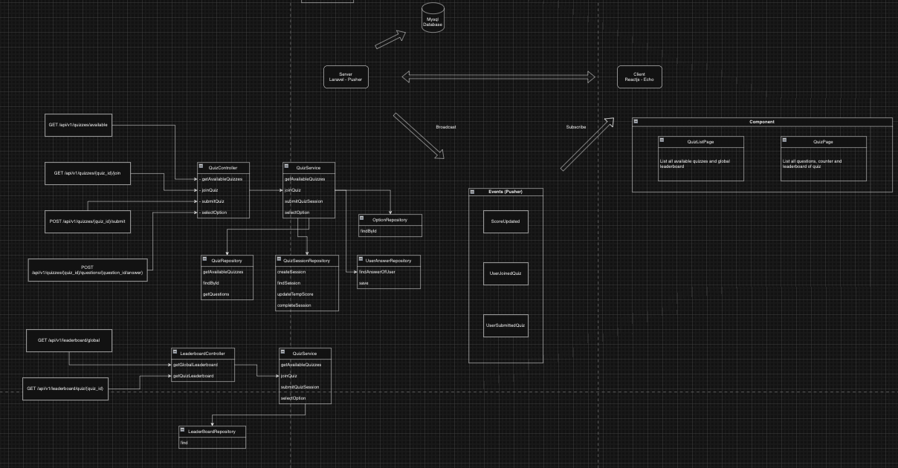

# Real-Time Vocabulary Quiz Coding Challenge

## Overview about the application

The application is a real-time vocabulary quiz that allows multiple users to join a quiz session using a unique quiz ID. As users submit answers, their scores are updated in real-time, and a leaderboard displays the current standings of all participants.
In this challenge, I will design and implement a component of the system that supports real-time quiz participation, score updates, and leaderboard updates.
I used the following technologies to implement the component:
- Laravel for the backend
- React for the frontend
- Pusher for real-time updates
- MySQL for the database
- Docker for containerization

## Architecture Diagram
https://drive.google.com/file/d/1x8aJePjJdc2edvOLqCA7BredxUcT0OB7/view?usp=sharing

## Implementation Details

### 1. **User Participation**
- **Requirement**: Users should be able to join a quiz session using a unique quiz ID. Multiple users can join the same quiz session simultaneously.
- **API Implemented**: `GET /api/v1/quizzes/{quiz_id}/join`

  **Purpose**: This API allows a user to join a quiz session by checking if the quiz has already been joined or if the time has expired. It handles the creation or resumption of the quiz session.

  **How It Works**: The backend first checks if a user session already exists for this quiz. If found, it resumes the quiz unless the session is expired or completed. If no session exists, a new one is created and the user is provided with the quiz questions.

### 2. **Real-Time Score Updates**
- **Requirement**: Scores must update in real-time as users submit their answers.
- **API Implemented**: `POST /api/1/quizzes/{quiz_id}/questions/{question_id}/answer`

  **Purpose**: This API handles the recording of a user’s selected answer, updates the user’s temporary score for the quiz, and broadcasts the event to reflect real-time score changes.

  **How It Works**: When a user selects an option, the backend checks if the answer is correct and updates the temporary score. This score is broadcasted using Laravel Echo/Pusher for real-time updates. The final score is only committed once the quiz is fully completed.

### 3. **Real-Time Leaderboard**
- **Requirement**: Display the current standings of all participants with real-time updates.
- **API Implemented**: 
  - `GET /leaderboard/global`: Get the global leaderboard with all participants.
  - `GET /leaderboard/quiz/{quiz_id}`: Get the leaderboard for a specific quiz.
  
   **Purpose**: These APIs provide the leaderboard data for all participants or a specific quiz. The data is updated in real-time as users submit their answers.

   **How It Works**: The backend fetches the leaderboard data from the database and broadcasts it using Laravel Echo/Pusher. The frontend listens for these events and updates the leaderboard in real-time.

## Data Flow
1. **User Participation**:
   - API: `GET /api/v1/quizzes/{quiz_id}/join`
   - A user joins a quiz session by providing a unique quiz ID.
   - The backend checks if the user has already joined the quiz and resumes the session if found.
   - If no session exists, a new session is created, and the user is provided with the quiz questions.
   - Real-time event: `quiz:joined` is broadcasted to update the UI.
2. **Real-Time Score Updates**:
   - API: `POST /api/1/quizzes/{quiz_id}/questions/{question_id}/answer`
   - A user submits an answer to a quiz question.
   - The backend checks if the answer is correct and updates the user’s temporary score.
   - The updated score is broadcasted in real-time using Laravel Echo/Pusher.
   - Real-time event: `score:updated` is broadcasted to update the UI.
3. **Quiz Completion**:
   - API: `POST /api/1/quizzes/{quiz_id}/complete`
   - When the quiz is completed, the user’s temporary score is committed to their total score.
   - The leaderboard is updated with the final scores.
   - Real-time event: `quiz:completed` is broadcasted to update the UI.
4. **Real-Time Leaderboard**:
   - API: `GET /leaderboard/global` or `GET /leaderboard/quiz/{quiz_id}`
   - The leaderboard data is fetched from the database.
   - When a user submits a completed quiz, the leaderboard is updated in real-time.

## Technical Details
- **Backend**: The backend is built using Laravel 11, a PHP framework. It provides RESTful APIs for quiz participation, answer submission, and leaderboard retrieval. The backend uses MySQL as the database to store quiz data, user sessions, and scores.
- **Frontend**: The frontend is built using React 17, a JavaScript library. It provides a user interface for joining quizzes, submitting answers, and viewing the leaderboard. The frontend uses Axios to make API requests to the backend.
- **Real-Time Updates**: Real-time updates are implemented using Pusher, a hosted service that provides real-time communication between servers and clients. The backend broadcasts events using Laravel Echo, and the frontend listens for these events to update the UI in real-time.
- **Docker**: The application is containerized using Docker to ensure consistency across different environments. The backend, frontend, and database are each deployed as separate containers.
- **Scalability**: The application is designed to be scalable by using a microservices architecture. Each component can be scaled independently to handle a large number of users and quiz sessions.
- **Performance**: The application is optimized for performance by using asynchronous processing. The backend uses Eloquent ORM for efficient database queries, and the frontend uses React's virtual DOM for fast rendering.
- **Repository Pattern**: The backend uses the repository pattern to separate data access logic from business logic. This makes the codebase more maintainable and testable.
- **Temporary Scores**: During the quiz, user scores are tracked as “temporary” scores and only committed to the user’s total once the quiz is completed. If the user fails to complete the quiz within the time limit, their score is discarded.
- **Leaderboard**: The leaderboard displays the top scorers in real-time and updates as users submit their answers. The leaderboard can be viewed globally or for a specific quiz.
- **Error Handling**: The application handles errors gracefully by returning appropriate HTTP status codes and error messages. The frontend displays error messages to users when an API request fails.
- **Event-Driven Architecture**: The application follows an event-driven architecture where events are broadcasted from the backend to the frontend using Pusher. This allows for real-time updates without the need for polling.

## Build for the Future

1. **Scalability**:
   - **Horizontal Scaling**: Use Docker and Kubernetes to scale the app horizontally, allowing it to handle many users/quiz sessions.
   - **Queue Management**: Utilize Redis with Laravel Queues for background processing of real-time events and intensive tasks (e.g., quiz completions).
   - **Database Optimization**: Implement database sharding and indexing to ensure smooth data retrieval for quizzes and leaderboards as user numbers grow.

2. **Performance**:
   - **Caching**: Use Redis or Memcached to cache frequently accessed quiz and leaderboard data.
   - **Lazy Loading**: Implement lazy loading for quiz questions and user data to reduce initial load times.
   - **Front-end Optimization**: Minimize JavaScript and CSS files with Vite and implement code splitting to load essential components first.

3. **Reliability**:
    - **Error Recovery**: Implement retry mechanisms for failed API requests and database transactions.
    - **Fault Tolerance**: Use Kubernetes to ensure high availability and fault tolerance by automatically restarting failed containers.
    - **Backup and Recovery**: Regularly back up the database and implement disaster recovery plans to restore data in case of failures.

4. **Maintainability**:
    - **Code Quality**: Enforce coding standards and best practices using tools like PHP-CS-Fixer and ESLint.
    - **Automated Testing**: Write unit tests and integration tests to ensure code quality and prevent regressions.
    - **Documentation**: Maintain up-to-date documentation for the codebase, APIs, and system architecture.

5. **Monitoring and Observability**:
   - **Logging**: Implement centralized logging with tools like ELK stack or Splunk to monitor application performance and troubleshoot issues.
   - **Metrics Collection**: Use Prometheus and Grafana to collect and visualize metrics such as response times, error rates, and resource usage.
   - **Tracing**: Implement distributed tracing with tools like Jaeger or Zipkin to track requests across microservices and identify bottlenecks.
